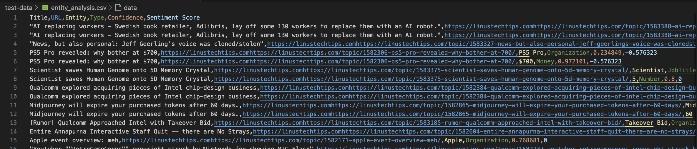

# LTT Forum Scraper and Entity Analyzer

## Overview

This Python script scrapes the Linus Tech Tips (LTT) forum for information of the tech news and performs entity analysis on the thread titles using IBM Watson's Natural Language Understanding service. The results are saved in CSV format for easy analysis.

## Benefits

As a technology forum, the news posted in the thread are highly valuable for analyzing the current state of tech companies, including fields such as gaming, crypto and social media. By obtaining the principal entities that figure on the popular news of the forum, it is possible to quickly isolate the companies and actors that might be of interest to people invested in the world of technology. This script provides variable data such as confidence, type and sentiment of the entity observed for customizable analysis of the data provided.

## Features

- Scrapes thread information from the LTT Tech News forum
- User-input of number of pages to scrape
- Entity analysis of thread titles using IBM Watson NLU
- Output saved in CSV format
- User-defined output directory

## Prerequisites

- Required Python packages:
  - requests
  - beautifulsoup4
  - ibm-watson
  - ibm-cloud-sdk-core

## Installation

1. Clone this repository or download the script.
2. Install the required packages:

   ```python
   pip install -r requirements.txt
   ```

3. Set up an IBM Watson NLU account and obtain your API key and URL.

## Setup

Replace the placeholder API key and URL in the script with your IBM Watson NLU credentials:

```python
authenticator = IAMAuthenticator('YOUR_API_KEY')
natural_language_understanding.set_service_url('YOUR_SERVICE_URL')
```

## Input

1. Run the script:

   ```python
   python main.py
   ```

2. Enter the number of pages to scrape when prompted.
3. Enter the output directory path when prompted (or press Enter to use the current directory).

## Output

The script generates two CSV files:

1. `scraped_threads.csv`: Contains information about the scraped threads

2. `entity_analysis.csv`: Contains entity analysis results for each thread title

Check the `test-data` folder to check sample output (last updated: September 22 2024).

*Note: Please do not remove the scraping cooldown out of respect to LTT forums.*



## Data format details

- The date is formatted in `YYYY-MM-DD HH:MM:SS` format.
- All unnecesssary whitespaces are removed.

## Limitations

- The script may be affected by changes to the LTT forum's HTML structure.
- Rate limiting or IP blocking may occur with excessive scraping.
- Entity analysis is limited to the title of each thread due to character limit constraints.

## Legal Considerations

Check `ETHICS.md` for more information.

## License

[MIT](https://choosealicense.com/licenses/mit/)